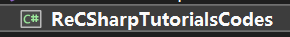

# 第1章  Hello world !

## 1-1 使用Visual Studio 2022进行C#编程

### 能不能不用Visual Studio？

不要问能不能不用Visual Studio写mod。不然：


当你具有一定的水平后，如果嫌Visual Studio过于笨重，你也可以尝试使用其他的编辑器，如VSCode

但既然从零开始，Visual Studio一定会是你最好的助手

安装问题参考https://fs49.org/2020/03/03/hello-world/

### 使用VS创建控制台应用程序

1. 打开Visual Studio 2022

2. 点击“创建新项目”

3. 选择控制台应用

4. 项目名称可以随意，教程使用“ReCSharpTutorialsCodes”，然后选择一个合适的路径

5. 框架选择.NET 6，**注意勾选不使用顶级语句**，我们需要认识完整的初始代码结构

   如果你没有.NET 6选项，请自行设法安装.NET 6 SDK，~~这是教程的一部分~~

   好吧提供一个.NET 6 SDK下载链接https://dotnet.microsoft.com/zh-cn/download/dotnet/6.0

6. 如果弹出“选择源代码管理”窗口，点击“取消”

然后你就可以看到~~喜闻乐见~~的打工界面了


在新版VS中，新创建的控制台应用程序会自动填充输出Hello, world!的代码。

~~如果没有自动填充的就自己写~~全都给我删了自己写啊喂！

### 利用IntelliSense写代码

当你在`Main()`下方的大括号里自己尝试写Hello world语句时，你将直观地感受到VS的强大


你可以使用光标或者是键盘选择候选框中的项目，然后使用`Tab`快速键入代码。如果灰色代码正确推断了你的意图，你可以连按两次`Tab`接受VS的建议。这种被称为**智能感知**的功能可以极大地提高你的编码速度和准确度。

写成这样之后，你可以看到VS为我们用红色波浪线标出了代码中的错误：


将光标悬停在波浪线上，可以看到VS对错误的提示和可能的修正方案：


按照VS的建议，输入`;`完成代码。

### 运行程序

确保没有任何报错后，我们可以尝试运行你的程序。


你可以直接按最左边的按钮，这将以**调试模式**启动程序，不过目前对我们没什么影响。调试功能将在后面讲解。


如果操作没有任何问题，你应该可以看到此界面。

## 1-2 审视Hello world代码

### 认识命名空间

让我们再回顾一下程序的代码。

```c#
namespace ReCSharpTutorialsCodes
{
    internal class Program
    {
        static void Main(string[] args)
        {
            Console.WriteLine("Hello, world!");
        }
    }
}
```

可以注意到，除了我们自己编写的`Console.WriteLine("Hello, world!");`语句外，VS还为我们生成了不少内容。

接下来让我们来了解一下**命名空间**的概念，也就是代码第一行的`namespace ReCSharpTutorialsCodes`。

简单来讲，命名空间是类(class)的容器，类的概念会在后面的章节中重点介绍。这里的`Program`类在命名空间的花括号中，即表示它在`ReCSharpTutorialsCode`命名空间中。

或许有些抽象，但是如果不使用命名空间，你将不得不面对下面的情况：

- `Console`必须写成`System.Console`

  

- `string`必须写成`System.String`

这看上去似乎也没什么？但是...

- `Program`必须写成`ReCSharpTutorialCodes.Program`
- `Language.GetText()`必须写成`Terraria.Localization.Language.GetText()`
- `ExampleWings`必须写成`ExampleMod.Content.Items.Accessories.Wing.ExampleWings`
- ......

当类、方法的名字不断变长时，代码会变得越来越难以维护。例如上面的例子“Tutorial”后面掉了一个s，你是否能注意得到？命名空间正是用于解决这个问题。即使是完全同名的类，在命名空间的区分下就不会发生混淆。如`A.Progream`和`ReCSharpTutorialsCodes.Program`表示的并不是同一个类，~~就好像从零群的棱镜和灾厄维基的棱镜不是同一个棱镜~~，但这依然没有从根本上解决问题，为了区别同名的类，我们还是必须键入完整的包含命名空间的类名，并没有达到简化代码的目的。因此，我们有了`using`语句来解决这个问题。

### 认识using语句

事实上，VS为我们生成的Hello world省略了不少using语句，例如`Console`类本应该在`System`命名空间下，我们需要在文件开头加上这样的语句将命名空间引入作用域。

```C#
using System;
```


其实最经典的hello world应当是这样的，而现在.NET版本的迭代使得一些极常用的命名空间（如`System`）可以省略不写using，~~所以我们在后面需要的时候再说如何正确使用using语句~~所以我们使用使用一些别的例子来演示using语句。

### 使用using语句

现在，让我们在解决方案管理器中创建一个`Utils.cs`文件，然后在其中填充一些代码。你暂时不需要理解代码的含义，这里是为了让你理解using语句的作用。

1. 右键解决方案管理器中的项目文件（见1-3）

   

2. 选择“添加”-“新建项”，然后选择“类”，修改文件名为`Utils.cs`

   

3. 点击添加

现在，你可以看到解决方案资源管理器中多了一个`Utils.cs`文件，并且代码编辑窗口已自动切换到`Utils.cs`。

```C#
using System;
using System.Collections.Generic;
using System.Linq;
using System.Text;
using System.Threading.Tasks;

namespace ReCSharpTutorialsCodes
{
    internal class Utils
    {

    }
}

```

它的内容看起来应该是这样的。

现在，我们修改它的命名空间，并填充一些代码。（注意，**不要在写模组时随意变动命名空间**！这里只是为了演示！）

```c#
using System;
using System.Collections.Generic;
using System.Linq;
using System.Text;
using System.Threading.Tasks;

namespace ReCSharpTutorialsCodes.MyUtils
{
    internal class Utils
    {
        public static void Hello()
        {
            Console.WriteLine("Hello!");
        }
    }
}
```

然后让我们回到`Program.cs`中，尝试键入Utils，然后你可以看到VS智能感知提出的建议：


如果此时你接受建议，VS会自动在文件开头添加一行`using ReCSharpTutorialsCodes.MyUtils;`

这时你就可以使用`Utils.Hello()`方法了。

```c#
using ReCSharpTutorialsCodes.MyUtils;

namespace ReCSharpTutorialsCodes
{
    internal class Program
    {
        static void Main(string[] args)
        {
            Utils.Hello();
        }
    }
}
```

你可以尝试编译并运行此程序，然后删掉VS自动生成的using语句，观察一下会发生什么事情？

> fs49中关于命名空间的文章：
>
> 物品属性修改
>
> https://fs49.org/2020/03/07/%e7%89%a9%e5%93%81%e5%b1%9e%e6%80%a7%e4%bf%ae%e6%94%b9/

### 认识Main

`Program`下的`static void Main(string[] args)`是控制台程序的**入口点**。通俗来讲，计算机并不会从第一行开始运行你的代码，而是找到这个方法，从这个方法开始执行你的程序。至于`internal`,`static`,`void`等关键字我们会在后面的教程中学习。

换言之，如果你需要运行一些教程中的代码，你应该在`Program`下的`Main`方法中写，如果写在别的地方，它们很可能并不会被执行。

## 1-3 审视解决方案管理器中的文件

现在让我们把视线移到解决方案管理器上来。


- **解决方案**  解决方案位于最顶级。每个C#应用程序都包含单个解决方案文件，而一个解决方案可以包含一个或多个项目。实际上，如果你在文件资源管理器中查看，你会发现它的命名为`ReCSharpTutorialsCode.sln`。
- **ReCSharpTutorialsCode**  这是C#项目文件，包含了应用程序所需的所有源代码文件、资源和配置信息。一个项目的所有代码必须使用相同的编程语言。在文件资源管理器中，该文件的实际名称是`ReCSharpTutorialsCode.csproj`。
- **依赖项**  也经常被称为**引用**（其实以前就是显示成引用）。简单来说，这里显示了你的项目使用了哪些其他的程序集。
- **Program.cs**  自动创建的源码文件，刚刚我们的Hello world程序就是在这个文件中编写的。
- **Utils.cs** 我们刚刚手动创建的源码文件。

事实上，在解决方案资源管理器中你可以清晰地看到你项目的层次结构，它可以用来浏览、添加、删除和编辑项目和文件。你还可以通过它来创建新的项目、新的文件、文件夹，还可以管理项目之间的依赖关系。通过右键单击，你可以对文件和项目进行特定的操作。

在下一章中我们将介绍变量、操作符和表达式。