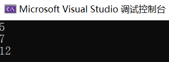

# 创建方法

## 声明方法

**方法**是具名的语句序列，每个方法都有名称和主体，方法名必须是一个合法的标识符，而方法主体包含了方法被调用时实际执行的语句。**方法必须在类的内部定义。**

声明一个方法的语法如下所示：

```C#
returnType methodName ( parameterList )
{
    //在这里写方法主体
}
```

- **returnType** 是一个类型名称，它指定了方法的返回值类型，可以是 `int`,`string` 之类的基元数据类型，也可以是自己定义的类型。

  如果要声明没有返回值的方法，应将returnType写为 `void`。

- **methodName** 是方法名，遵循标识符的命名规则。

- **parameterList** 是参数列表，描述了允许传给方法的数据的类型和名称。参数列表可以是空的。

- 方法主体必须写在一对大括号中。

几个方法的具体例子如下，我们在 `Program` 类中声明这些方法。为了使这些方法能在 `Main()` 函数中使用，我们将它标记为 `static`，关于 `static` 的用法以及可访问性问题在第7章中有详细的介绍。

```C#
internal class Program
{
    static int CalcAdd(int a, int b)
    {
        int c = a + b;
        return c;
        //计算a+b的值存储在变量c中，然后将c的值作为返回值。
    }
    static void Print(string text)
    {
        Console.WriteLine(text);
        //输出文本，无返回值。
    }
    static void Main(string[] args)
    {
		//入口点
    }
}

```

如果你要复制这段代码，请记得把上面的类复制到命名空间中。

注意，你不能在参数列表和返回值类型上使用 `var` 关键字。

## 从方法返回数据

如果你希望从方法中返回数据（返回类型不是void），那么你必须在方法内使用 `return` 语句。正如上面的 `CalcAdd()` 一例，先写出 `return` 关键字，然后添加计算返回值的表达式，最后加上分号。注意，表达式的结果类型必须和方法指定的返回类型相同。

```c#
static int CalcAdd(int a, int b)
{
    int c = a + b;
    return "";
    //计算a+b的值存储在变量c中，然后将c的值作为返回值
}
```

上面的写法不能通过编译，因为 `CalcAdd()` 方法的返回类型已被声明为 `int`，你不能用 `return` 关键字返回一个 `string`。

**return语句会立刻结束方法**。如果你在 `return` 语句后写了其他语句，VS会提示你”检测到无法访问的代码“。此外，在 `void` 方法中，你可以通过 `return;` 这一语句立刻结束方法。标记为 `void` 的方法中可以没有 `return` 关键字，但除此之外**方法必须保证有返回值**。

## 使用表达式主体方法

如果一个方法的主体非常简单，我们可以用下面的写法来简化方法声明：

```C#
static void ShowResult(int answer) => Console.WriteLine(answer);
```

这种写法和使用花括号的写法没有任何区别，`=>` 符号右边的表达式的结果将自动作为方法的返回值。这种在功能上没有区别，而使语法简化的写法称为**语法糖**。

## 调用方法

声明方法自然是为了调用方法，就好比学习C#技术是为了写mod一样。你可以通过方法名来调用方法，提供方法需要的参数（如果有），并获得方法的返回值。调用方法例子如下：

```C#
int a = 1;
CalcAdd(a,2); //OK，忽略了返回值，尽管大多数时候不应该这么做
int c = CalcAdd(a,2); //OK，将方法的返回值赋给变量c
Print("爬"); //OK，没有返回值
```

可以注意到方法名后小括号中的内容，它们称为**参数**。调用方法时，必须为每个形式参数（**形参**）提供值，也就是实际参数（**实参**）。对于接受多个参数的方法，你需要使用逗号隔开不同的参数。

让我们以 `CalcAdd()` 为例具体分析方法的调用。

```C#
static int CalcAdd(int a, int b)
{
    int c = a + b;
    return c;
    //计算a+b的值存储在变量c中，然后将c的值作为返回值。
}
static void Main(string[] args)
{
    int arg1 = 1, arg2 = 2;
    int result = CalcAdd(arg1, arg2);
    Console.WriteLine(result);
}
```

该方法有两个 `int` 参数，所以调用方法时必须提供两个以逗号为分隔的 `int` 实参。你可以使用变量作为实参，变量的值会被传递给方法。然后在第4行方法通过 `return` 语句返回两个参数相加的值，方法执行结束，回到 `Main()` 方法中，然后返回值被赋值给 `result` 变量，最后我们将它打印到控制台中。

> **区别形参和实参**
>
> 形参是编写方法时使用的参数名，而实参是程序运行过程中实际传给方法的数据。换言之，形参是占位符，实参是实际的数据。

# 使用作用域

## 作用域的概念

我们已经在C#中见到了许多使用花括号的地方。对于方法中声明的变量，其有效期开始于被声明的位置，结束于方法结束的位置。换言之，在同一个方法中，后续的语句都可以使用该变量，而方法执行完毕后，变量随之“消失”，不再能继续使用。如果某变量能在程序的特定位置使用，我们就称变量在那个位置“处于作用域”内。**作用域**是指该变量能起作用的程序区域，除了变量有作用域之外，标识符也有。它们的作用域和声明的位置有关。

## 定义局部作用域

我们尝试在 `Main()` 方法中输出 `c` 的值：

```C#
static int CalcAdd(int a, int b)
{
    int c = a + b;
    return c;
    //计算a+b的值存储在变量c中，然后将c的值作为返回值。
}
static void Main(string[] args)
{
    int arg1 = 1, arg2 = 2;
    int result = CalcAdd(arg1, arg2);
    Console.WriteLine(result);
    Console.WriteLine(c); //非法
}
```

可以发现编译器报错，因为 `c` 只能由 `CalcAdd()` 方法使用。界定方法的大括号也同时界定方法的作用域，在方法主题中声明的任何变量都在该作用域中，只能由方法内部的代码访问，它们称为**局部变量**。你不能在其他方法中使用此方法内定义的局部变量。

## 定义类作用域

如果我们将 `c` 的声明从 `CalcAdd()` 方法中挪出，放入 `Program` 类的大括号中，会发生什么呢？

```c#
internal class Program
{
    static int c;
    static int CalcAdd(int a, int b)
    {
        c = a + b;
        return c;
        //计算a+b的值存储在变量c中，然后将c的值作为返回值。
    }
    static void Main(string[] args)
    {
        int arg1 = 1, arg2 = 2;
        int result= CalcAdd(arg1, arg2);
        Console.WriteLine(result);
        Console.WriteLine(c); //合法
    }
}
```

可以发现此时第15行合法，因为此时的 `c` 定义在 `Program` 类中。这些定义在类中的变量称为**字段**。不同于局部变量，字段可以在该类的任何方法中使用。你可以通过字段在方法之间共享信息。关于字段的问题我们会在第7章中讨论。

此外，你可以在类的任何位置（方法主体外）（不许故意找茬！）中定义字段，而无需像在局部作用域中那样先声明后使用。编译器会为你打点好一切的。

## 重载方法

如果两个标识符同名且在同一作用域内，我们就称它们被**重载**。重载的标识符往往是bug，VS会捕捉并报错。例如，你无法在同一局部定义域中声明两个 `a` 变量：

```C#
int a = 1;
Console.WriteLine(a);
int a; //非法
```

同理，在同一个类中声明两个相同的字段，或者两个完全一样的方法，也会发生编译错误。但有一种办法可以真正地重载标识符，而且这种重载十分有用。

前面我们讲到，声明方法时参数的类型是确定的，但我们一直在使用的  `Console.WriteLine()` 方法为什么能接收多种不同类型的参数？

如果我们借助VS的智能感知，我们会发现它具有许多不同的版本：


编译时，VS检查你传入参数的类型，并自动调用方法的合适版本以处理数据。因此，要针对不同数据类型或信息组别执行相同的操作，重载是一项非常有用的技术。如果方法有多个实现，每个实现的参数列表都不相同，就可以重载该方法。注意，你不能重载方法的返回类型，编译器并没有那么强大到那种程度。

下面是 `Console.WriteLine()` 方法进行重载的例子，不同的实现具有不同的参数列表来重载：

```C#
public static class Console
{
    //...
	public static void WriteLine(int val)
    {
        //...
    }
	public static void WriteLine(string val)
    {
        //...
    }
	public static void WriteLine(float val)
    {
        //...
    }
	public static void WriteLine(double val)
    {
        //...
    }
    //...
}
```

# 编写方法

接下来我们尝试编写方法，实现从控制台读入两个整数，输出它们相加的和。

## 编写子方法

首先声明一个 `readInt()` 方法，我们调用该方法来从控制台读入整数：

```C#
private static int readInt()
{
    string t = Console.ReadLine();
    int ret = int.Parse(t);
    return ret;
}
```

我们调用 `Console.ReadLine()` 方法从控制台读入一行字符串，将其存储到变量 `t` 中，然后使用 `int.Pasre` 方法将它转换为 `int` 存储到变量 `ret` 中，最后用 `return` 语句将 `ret` 返回。

然后我们使用之前的 `CalcAdd()` 方法：

```C#
private static int CalcAdd(int a, int b)
{
    int c = a + b;
    return c;
}
```

## 调用方法

然后回到 `Main()` 方法中，调用上面的方法来完成任务：

```C#
static void Main(string[] args)
{
    int num1 = readInt();
    int num2 = readInt();
    int sum = CalcAdd(num1, num2);
    Console.WriteLine(sum);
}
```

然后你可以尝试运行程序，5和7为通过键盘输入的值，12是输出值。



# 使用可选参数和具名参数

## 使用可选参数

声明方法时，你可以“初始化”一些参数，就像下面这样：

```C#
public static void DoSomeWorks(int a, int b = 0, int c = 0)
{
    //...
}
```

这时如果你尝试调用此方法，可以发现VS给出的提示有所不同：


填写参数时，你可以仅传入一个实参，此时 `b` 和· `c` 将使用声明时初始化的值0，你也可以传入多个参数：

```C#
DoSomeWorks(1,1); // a将被赋值为1，b将被赋值为1，c仍为0
DoSomeWorks(1,1,1); // a,b,c均为1
```

## 使用具名参数

调用方法时，C#允许你按名称指定参数，这样就可以按照不同顺序传递实参。

下面的例子和编写方法一节中的代码功能相同，但参数按照名称指定：

```C#
CalcAdd(b: 9, a: 10); //OK
CalcAdd(10,b: 9) //混合使用按位置和按名称，但必须先按位置指定实参
```

调用具有可选参数的方法时，你可以通过具名参数省略实参：

```C#
DoSomeWorks(a: 1, c: 9); //OK，b将为初始值0
```

## 消除可选参数和具名参数的歧义

假定一组重载方法：

```C#
static void OptMethod(int first, double second = 0.0, string third = "hello")
{
    //...
}
static void OptMethod(int first, double second = 1.0, string third = "bye", int fourth = 100)
{
    //...
}
```

如果我们按下面的代码调用方法：

```C#
OptMethod(1, 2.5, "World");
//哪一个版本会被调用？
```

这样的代码是合法的。编译器会调用和方法调用最匹配的方法，即具有3个参数的版本，而非4个。

假如我们使用具名参数：

```C#
OptMethod(1, fourth: 101);
//显然是第二个版本会被调用
```

很显然，只有第二个方法能匹配该调用。但下面的调用该如何考虑呢？

```C#
OptMethod(1, 2.5);
```

这时两种实现都不能完全匹配提供的实参。两个版本中，`second`,`third`,`fourth` 都是可选参数。所以无法确认应当选取哪种版本。编译器将其视为有歧义的方法调用，会提示错误。同理，下面的例子也是有歧义的调用：

```C#
OptMethod(1, third: "World");
OptMethod(1);
OptMethod(second: 2.5, first: 1);
```

要想消去歧义，必须妥善安排参数位置并利用具名参数。

# 调试代码

让我们回到之前编写方法的例子。

```C#
internal class Program
{
    private static int readInt()
    {
        string t = Console.ReadLine();
        int ret = int.Parse(t);
        return ret;
    }
    static int CalcAdd(int a, int b)
    {
        int c = a + b;
        return c;
        //计算a+b的值存储在变量c中，然后将c的值作为返回值。
    }
    static void Main(string[] args)
    {
        int num1 = readInt();
        int num2 = readInt();
        int sum = CalcAdd(num1, num2);
        Console.WriteLine(sum);
    }
}

```

先前我们提到过，使用最左侧的按钮将以调试模式运行程序：


（现在先别急着点啊喂！）

接下来让我们利用调试功能分析代码是如何运行的。

## 使用断点

我们在编辑器最左侧的灰色边框上单击，可以发现本行被标红：


然后我们以调试模式执行程序，输入两个整数后，发现程序中断在断点处：


其中的箭头和高亮行指示了当前正准备执行的代码。

## 查看和修改局部变量

在暂停状态下，你可以将鼠标悬停在变量上查看它们的值：


此外，在代码编辑器下方的窗口中也可以查看并修改局部变量：


我们可以尝试将c修改为8，观察现象：


可以发现程序的输出被修改。

此外，监视窗口中可实时计算表达式的值。VS的实时调试功能十分强大，你需要逐步探索相关的功能。


在下一章中，我们将学习判断语句的使用。