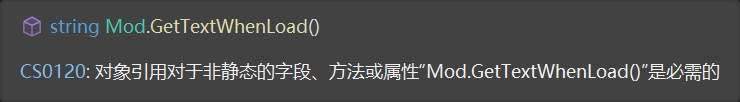

# 第7章  创建并理解类和对象

## 7.1 创建并使用类

### 声明Mod类

在C#中，我们通过`class`关键字来声明一个类。

接下来我将向你展示一个`Mod`类。

（注意，这和tModLoader中的Mod类没有任何关系，仅是为了演示）

~~（可别让群友发现你的Mod报了错是因为把这里的代码抄上去了）~~

~~（更别说是我教的）~~

```c#
class Mod
{
    string Name;
    string Author;
    int ModID;
    string GetTextWhenLoad()
    {
        return $"[{Name}]作者：{Author}";
    }
}
```

在类中声明的变量，我们称之为**字段**(Field)。这个`Mod`类包含三个字段: `Name`,`Author`,`ModID`。而`GetTextWhenLoad`是一个方法，我们通过调用它来获取Mod加载时显示的文字。如何声明变量和编写方法在前面已经讲过，所以这里实际上并没有多余的语法。

### 使用Mod类

然后，让我们尝试使用Mod类

```c#
Mod mod; //声明一个Mod变量
mod = new Mod(); //初始化
```

或许你现在还无法理解上面的代码做了什么，没关系，因为它现在~~确实什么都没有做~~（看上去如此）。

但需要注意的是，我们在这里用到了`new`关键字，这个关键字用于**创建类的实例**。类是类型的定义，对象则是该类型的实例。如果你不能理解，那你可以将类想象成一个蓝图，而类的实例就是从该蓝图制作出的物件，更通俗地来说，就是**对象**。同一个类可以有多个实例，正如同一张蓝图可以量产物件。

注意，下面的写法都是不正确的，你不能将其他类型的对象赋值给mod变量。

```c#
Mod mod;
mod = 49; //尽管是49，但它并不是49落星mod（雾）
mod = new Exception(); //故意找茬.jpg
```

你可以把Mod对象赋值给相同类型的另一个变量，尽管这样赋值时发生的事情或许并不是你想象的那样（参考第八章）

```c#
Mod mod;
mod = new Mod();
Mod mod2;
mod2 = mod;
```

## 7.2 控制可访问性

非常奇妙的是，你的Mod类现在没有任何实际用处~~(将来的Mod也不会有)~~。默认情况下，类中的方法和变量已和外部划清界线。在类的方法中可以访问类的字段，但你此时无法在外界访问它的字段，抑或是调用`GetTextWhenLoad`方法。

### 让我访问！

因此，我们要控制可访问性。修改`Mod`类的定义:

```C#
class Mod
{
    private string Name;
    private string Author;
    private int ModID;
    public string GetTextWhenLoad()
    {
        return $"[{Name}]作者：{Author}";
    }
}
```

我们为`GetTextWhenLoad`方法添加了`public`关键字进行修饰，使得它们能被外界访问。

### 不许访问！

`private`关键字将`Name`,`Author`和`ModID`字段设为私有。事实上，不使用任何可访问性关键字修饰的成员默认都是私有的，但作为良好编程实践，你应该显式将字段和方法声明为`private`，以避免困惑。（此处成员指字段、方法、属性、索引器等写在类中的东西）

但此时的Mod类依然没有任何用处，因为你无法初始化`Name`,`Author`和`ModID`字段。因此我们需要为Mod类编写构造器。

## 7.3 使用构造器

### 声明默认构造器

**构造器**是在创建对象时自动运行的方法，它与类同名，能获取参数，但不返回任何值（哪怕是`void`）。每个类至少要有一个构造器。如果你不编写自己的构造器，编译器会自动创建一个什么都不做的默认构造器。下面为`Mod`类手动实现了默认构造器，你可以通过这个例子了解构造器的基本语法。

```C#
class Mod
{
    private string Name;
    private string Author;
    private int ModID;
    public string GetTextWhenLoad()
    {
        return $"[{Name}]作者：{Author}";
    }
    public Mod()
    {
        //默认构造器
    }
}
```

我们将该构造器声明为`public`以使其能通过`new`关键字使用。如果你声明一个私有的默认构造器，那么该类将无法使用默认构造器创建实例。私有构造器的用途超出了本教程的范围，不作赘述。

### 重载构造器

构造器像方法（其实就是一种特殊的方法）一样可以**重载**。接下来我们为Mod类编写一个重载构造器，使其从外界获取三个参数来初始化`Name`,`Author`和`ModID`字段。

```C#
class Mod
{
    private string Name;
    private string Author;
    private int ModID;
    public string GetTextWhenLoad()
    {
        return $"[{Name}]作者：{Author}";
    }
    public Mod()
    {
        //默认构造器
    }
    public Mod(string name, string author, int modId)
    {
        //重载构造器
        this.Name=name;
        this.Author=author;
        this.ModID=modId;
    }
}
```

在上面的例子中，`this`关键字指代该对象本身。VS此时或许会提醒你可以省略`this`关键字，但当方法的参数和字段重名时，你必须使用`this`关键字来避免不明确的引用。

接下来我们可以使用这个接收参数的构造器来创建对象了。

```C#
Mod mod = new Mod("没什么用的Mod","你的名字",114514);
```

然后可以在`Main()`中调用它的`GetTextWhenLoad`方法

```C#
Console.WriteLine(mod.GetTextWhenLoad());
```

如果操作没有出现错误，运行程序，你应当可以得到类似的输出

```
[没什么用的Mod]作者：你的名字
```

## 7.4 理解静态方法和数据

### 静态方法

我们经常使用`Console.WriteLine()`方法来向控制台输出内容，你是否发现这和我们刚才的例子有些不同？在刚才的例子中，如果你尝试这样写：

```c#
Mod.GetTextWhenLoad();
```

你会得到来自VS的贴心提示：



为什么会这样呢？因为`Console.WriteLine()`方法被声明为`static`。`static`关键字可将方法或字段声明为静态，然后就可以直接通过类名调用方法或访问字段。`static`关键字用于修饰**不需要依赖于类的实例的工具方法或实用方法**，例如`Console.WriteLine()`方法的声明实际上是这样的：

```c#
class Console
{
    //...
    public static void WriteLine(string value)
    {
        //...
    }
    //...
}
```

静态方法不依赖类的实例，也不能访问类的任何实例字段或方法。相反，它只能访问声明为`static`的其他方法和字段。而类的实例依然可以访问类的静态成员。

### 静态字段

静态字段能在类的所有对象之间共享（而非静态的则局限于具体的对象）。在下面的例子中，每次创建`Mod`对象我们都将`ModCount`静态字段递增1。

```c#
class Mod
{
    private string Name;
    private string Author;
    private int ModID;
    public static int ModCount = 0;
    public string GetTextWhenLoad()
    {
        return $"[{Name}]作者：{Author}";
    }
    public Mod()
    {
        //默认构造器，稍加修改
        Name = "None";
        Author = "Anonymous";
        ModCount++;
    }
    public Mod(string name, string author, int modId)
    {
        //重载构造器
        this.Name = name;
        this.Author = author;
        this.ModID = modId;
        ModCount++;
    }
}      
```

这样，我们可以通过`ModCount`来查询创建过的`Mod`对象数量，例如：

```C#
Mod mod1 = new Mod(); //通过默认构造器创建Mod对象
Mod mod2 = new Mod("Mod2", "还是你的名字", 1919810);
Console.WriteLine(Mod.ModCount);
```

需要注意的是，在类之外的地方(上面的例子，在`Program.Main()`函数中)访问静态字段必须以`Mod`作为前缀。

### 使用const关键字

你可以用`const`关键字声明**常量字段**，它是一种特殊的静态字段，不需要使用`static`。它的值永远不会改变。只有数值类型(`int`,`double`)、字符串类型和枚举类型的字段才能声明为`const`。例如，在`Math`类中声明有`PI`字段：

```C#
class Math
{
    //...
    public const double PI = 3.14159265358979;
}
```

## 7.5 理解静态类

你可以将一个类声明为静态，静态类只能包含静态成员，纯粹作为工具方法和字段的容器使用。静态类不能包含任何实例成员，同时，使用`new`关键字创建静态类的对象没有意义，编译器会报错。为了进行初始化，你可以使用**静态构造器**，和构造器类似，但需要声明为`static`，且不能接收任何参数。声明其他构造器都是非法的。

例如，创建一个自己的工具类。

```C#
public static class Math //注意，真实的Math类并非静态
{
    public static Math()
    {
        //静态构造器
        //...
    }
    public static double Sin(double x) {  }
    public static double Cos(double x) {  }
    public static double Sqrt(double x) {  }
    //...
}
```

## *7.6 匿名类

匿名类，顾名思义，是没有名字的类。

由于在模组编程中并不常用到，因此不在这里赘述，有兴趣可以自己查询相关资料进行了解。
